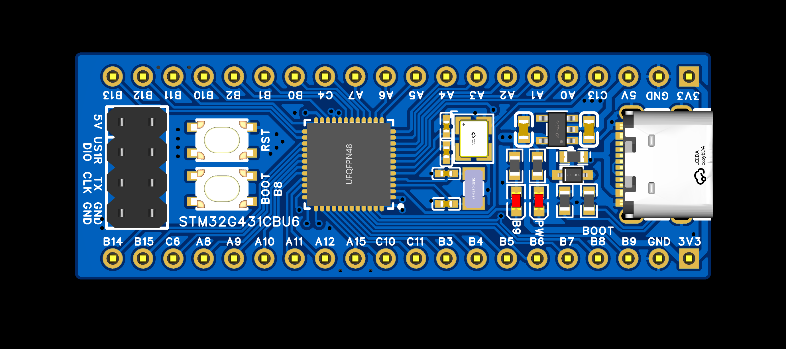

# STM32G431CBU6最小系统板
## 项目简介
为了各位同学在电赛期间能有性能强大且价格合适的通用STM32开发板使用，无线电爱好者协会各部长联合设计并验证了一款基于 STM32G431CBU6 MCU的最小系统开发板。

## 项目目录
### HARDWARE
收录硬件相关内容具体如下：

1. 电路原理图（.PDF）
2. PCB制板文件（.zip）
3. 元件清单（.xlsx）
4. LCEDA_PRO工程文件（.epro）
### SOFTWARE
包含示例代码：

1. 板载用户按键例程

## 硬件
### MCU
STM32G431CBU6

170MHz Arm Cortex-M4

128 Kbytes Flash
### 晶体振荡器
外部 32.768KHz

外部 25MHz

### POWER
RT9013-33GB

0603自恢复保险丝

1N5819WS肖特基二极管

### 按键
1. RESET按键

2. BOOT按键
（可作为用户按键使用，
配置到PB8，已外部拉低）
### LED
1. POWER-LED（5V电源指示）

2. USER-LED（连接到PB9，低电平亮起）

## 软件
### BOOTKEY工程
使用TIM15定时器中断驱动板载BOOT按键，实现了非阻塞“单击”、“长按”的实现，并在USART1输出按键状态。